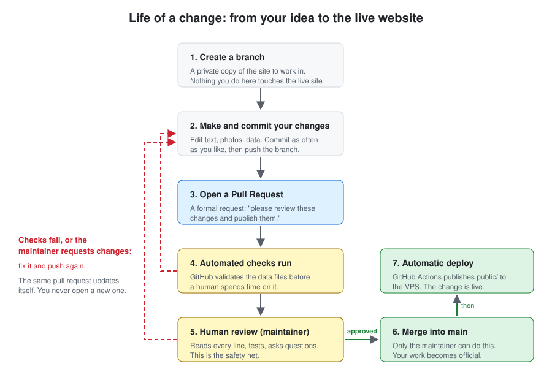

# Contributing to the KAZI website

Everything you need to know to help edit **kazi-website**, even if you have never used GitHub before.

This document explains three things:

1. How to **get access** to the repository.
2. How to **propose a change** (a "pull request") and what happens to it.
3. **Why** we work this way instead of letting everyone edit the live site directly.

If you only remember one sentence, remember this one:

> **Anyone on the team can propose a change. Nothing reaches the live website until a human has read it and approved it.**

---

## Table of contents

- [1. The short version](#1-the-short-version)
- [2. Words you will see, in plain language](#2-words-you-will-see-in-plain-language)
- [3. Getting access to the repository](#3-getting-access-to-the-repository)
- [4. What each permission level can do](#4-what-each-permission-level-can-do)
- [5. Making a change: the pull request](#5-making-a-change-the-pull-request)
- [6. Two ways to edit, pick the one that suits you](#6-two-ways-to-edit-pick-the-one-that-suits-you)
- [7. What the reviewer checks](#7-what-the-reviewer-checks)
- [8. The three possible answers to your pull request](#8-the-three-possible-answers-to-your-pull-request)
- [9. Why we do it this way](#9-why-we-do-it-this-way)
- [10. The rules protecting `main`](#10-the-rules-protecting-main)
- [11. Frequently asked questions](#11-frequently-asked-questions)
- [12. Who to contact](#12-who-to-contact)

---

## 1. The short version

| Step | What happens | Who does it |
| --- | --- | --- |
| 1 | Ask for access | You |
| 2 | Get invited as a collaborator | Maintainer |
| 3 | Create a branch and make your change | You |
| 4 | Open a pull request | You |
| 5 | Automated checks run | GitHub |
| 6 | Review: read, question, approve | Maintainer |
| 7 | Merge into `main` | **Maintainer only** |
| 8 | The site deploys automatically | GitHub Actions |

You are responsible for steps 1, 3 and 4. Everything else happens around you.

---

## 2. Words you will see, in plain language

| Word | What it actually means |
| --- | --- |
| **Repository** (repo) | The folder holding the whole website and its full history. |
| **`main`** | The official version. Whatever is in `main` **is** the live website. |
| **Branch** | Your own private copy of the site where you can work freely. Changing your branch changes nothing for visitors. |
| **Commit** | A saved step of your work, with a short message saying what you changed. |
| **Push** | Sending your commits from your computer up to GitHub. |
| **Pull request** (PR) | A formal request: *"here is what I changed, please review it and publish it."* It shows every modified line side by side. |
| **Review** | A human reads the pull request and either approves it or asks for changes. |
| **Merge** | Accepting the pull request and folding your work into `main`. |
| **Deploy** | Copying the site to the server so the public sees it. This happens automatically after a merge. |
| **Maintainer** | The person responsible for the repository. Currently **@zeke321**. |

---

## 3. Getting access to the repository


### Step by step

**1. Create a free GitHub account** at [github.com/signup](https://github.com/signup) if you do not have one. Use a name your colleagues will recognise.

**2. Ask for access.** Two ways, either is fine:

- Open an issue in this repository: **Issues -> New issue**, titled `Access request: <your name>`, or
- Email the maintainer directly.

Please say:

- who you are and your role at KAZI,
- what you would like to work on (text, photos, project data, translations, code),
- your GitHub username.

**3. The maintainer reviews the request.** Access is given to KAZI members and to trusted helpers working on the site. There is no automatic approval.

**4. You receive an invitation** by email and at the top of the repository page. Click **Accept invitation**. Invitations expire after 7 days; if yours has, just ask again.

**5. You are in.** You can now create branches and open pull requests.

> **Important:** being a collaborator does **not** mean you can publish. It means you can *propose*. Publishing is one person's responsibility, on purpose.

---

## 4. What each permission level can do

| Action | Contributor (Write) | Maintainer (Admin) |
| --- | --- | --- |
| Read the code and history | Yes | Yes |
| Create a branch | Yes | Yes |
| Push commits to their own branch | Yes | Yes |
| Open a pull request | Yes | Yes |
| Comment on and review others' pull requests | Yes | Yes |
| Push directly to `main` | **No** | **No** (the rule applies to everyone) |
| **Merge a pull request into `main`** | **No** | **Yes** |
| Force-push or delete `main` | **No** | **No** |
| Change repository settings and secrets | No | Yes |

Note the second-to-last line: the protection rule applies to the maintainer too. Nobody rewrites or deletes the history of `main`, ever, including by accident.

---

## 5. Making a change: the pull request



### 1. Create a branch

Never work directly on `main`. Start from a branch named after what you are doing:

```bash
git checkout main
git pull
git checkout -b fix-team-photos
```

Good branch names: `fix-team-photos`, `add-2026-report`, `traduction-page-projets`.

### 2. Make your change and commit it

```bash
git add .
git commit -m "Update team photos and job titles for 2026"
git push -u origin fix-team-photos
```

Write commit messages a human can understand. "Update team photos" is useful; "changes" or "fix" is not.

### 3. Open the pull request

On GitHub the pushed branch shows a **Compare & pull request** button. Click it, or go to **Pull requests -> New pull request**, and set the target to `main`.

In the description, answer three questions:

- **What** did you change?
- **Why?** (a request from the team, a typo you spotted, a new report to publish...)
- **How can the reviewer check it?** (which page, which section)

Add a screenshot if you changed something visual. It saves the reviewer a lot of time.

### 4. Automated checks run

GitHub automatically runs `scripts/check_data.py` against your branch. It verifies that:

- every file in `public/data/` is valid JSON (one missing comma breaks a whole page),
- required fields are present,
- every photo and PDF referenced by the data actually exists in the repository.

If a check fails, you will see a red cross on the pull request. Click **Details** to read the error, fix it, commit and push again. **The same pull request updates itself** — you never need to open a new one.

### 5. Human review

The maintainer reads the change, may test it, and may ask questions in the comments. Answer in the same thread. This is a conversation, not an exam.

### 6. Merge

Once approved, the maintainer merges. Your work is now part of `main`.

### 7. Automatic deploy

Merging into `main` triggers `.github/workflows/deploy.yml`, which publishes the contents of `public/` to the KAZI server. Within a couple of minutes, the change is live. You do not need to do anything, and you must never copy files onto the server by hand.

---

## 6. Two ways to edit, pick the one that suits you

### A. Without installing anything (recommended for content)

- **Pages CMS** — the repository is configured for [pagescms.org](https://pagescms.org) (see `.pages.yml`). It gives you web forms for projects, team members, partners, stats and site texts, with no code visible. Every save becomes a commit.
- **The GitHub website** — open any file, click the pencil icon, edit, and at the bottom choose **"Create a new branch for this commit and start a pull request."** GitHub does the branching for you.

### B. With Git on your computer (recommended for code)

```bash
git clone https://github.com/zeke321/kazi-website.git
cd kazi-website
python scripts/check_data.py
```

The site is plain HTML, CSS and JavaScript under `public/`. To preview it locally:

```bash
python -m http.server 8000 --directory public
```

Then open <http://localhost:8000>.

### What lives where

| Folder | Contents |
| --- | --- |
| `public/` | The website itself. Everything here goes online. |
| `public/data/` | The content: projects, team, partners, reports, stats, texts. |
| `public/assets/` | Photos and logos. |
| `public/reports/` | PDF reports. |
| `scripts/check_data.py` | The validation script run by the automated checks. |
| `deploy/` | Server configuration. **Do not touch without asking.** |
| `.github/workflows/` | Automation. **Do not touch without asking.** |

---

## 7. What the reviewer checks

Not a judgement of you — a checklist on the change:

- **Accuracy.** Are names, dates, figures and project descriptions correct? Wrong numbers in an annual report damage KAZI's credibility with donors.
- **Both languages.** French and English versions stay consistent.
- **Images.** Correct file, reasonable size, and we have the right to publish it — **especially photos of identifiable people**.
- **Personal data.** No private phone numbers, home addresses or unpublished emails.
- **Nothing secret.** No passwords, API keys or SSH keys, ever, in any file.
- **Not broken.** The page still displays correctly, links work.
- **Scope.** The change does what the description says and nothing else.

Reviews are usually done within a few days. If your pull request is urgent, say so in the title, for example `[URGENT] Fix wrong donation link`.

---

## 8. The three possible answers to your pull request

| Answer | Meaning | What you do |
| --- | --- | --- |
| ✅ **Approve** | Everything is good. | Nothing. The maintainer merges. |
| 💬 **Comment** | A question or a remark, no decision yet. | Answer in the thread. |
| 🔄 **Request changes** | Something must be fixed before publishing. | Fix it, commit, push to the same branch. The pull request updates itself. |

"Request changes" is normal and frequent, including on the maintainer's own pull requests. It is a comment on a few lines of a file, not on you.

---

## 9. Why we do it this way

The KAZI website is the public face of the organisation. Donors, partners and institutions read it. It is deployed **automatically**: anything merged into `main` is online minutes later, with no further human step.

Without review, a single command from any collaborator — including a well-meaning one — could put the following online instantly:

- a missing comma in `projects.json`, leaving the projects page blank,
- a wrong bank account or a broken donation link,
- an incorrect figure in an annual report,
- a photo of a person who never agreed to appear on the site,
- a deleted page nobody noticed until a partner reported it,
- in the worst case, a credential committed by mistake and now public forever.

Requiring a pull request means **every line is read by a second human before the public sees it.** The automated checks catch machine-detectable mistakes; the human catches the rest.

There is a second benefit: history. Every change carries an author, a date, a reason and a discussion. Six months later, "who changed this figure and why?" is a question with an answer.

And a third: safety to experiment. Because your branch is isolated, you **cannot** break the live site by trying something. The worst possible outcome of a bad pull request is that it is not merged.

---

## 10. The rules protecting `main`

The `main` branch is protected. These rules are enforced by GitHub, not by trust:

| Rule | Effect |
| --- | --- |
| **Require a pull request before merging** | No one can push a commit straight to `main`. |
| **Require 1 approval** | A pull request cannot be merged until someone has approved it. |
| **Require status checks to pass** | The data-validation check must be green. |
| **Block force pushes** | Nobody can rewrite the history of `main`. |
| **Restrict deletions** | `main` cannot be deleted. |
| **Only the maintainer can merge** | Merging into `main` is restricted to @zeke321. |

If you try to push to `main`, Git will refuse with a message like `protected branch hook declined`. That is not a bug, and you have not broken anything. Put your work on a branch and open a pull request instead.

---

## 11. Frequently asked questions

**I am not a developer. Can I still help?**
Yes. Most of the site's content lives in simple data files, editable through Pages CMS web forms or the GitHub editor. No code required.

**I made a mistake in my pull request. Have I broken the site?**
No. Nothing reaches the live site before a merge. Push a fix to the same branch, or close the pull request and start again.

**Can I see my change before it goes live?**
Yes. There is a `preview` branch, published to the preview site. Ask the maintainer to deploy your branch there if you want to see it in context before merging.

**How long does review take?**
Usually a few days. Mention it in the pull request title if it is urgent.

**Someone gave me a file to publish, can I put it directly on the server?**
No. Never copy anything onto the server by hand. It would be silently overwritten on the next deploy, and there would be no record of the change. Always go through a pull request.

**Can I review someone else's pull request?**
Please do. Any collaborator can read a pull request and comment. A second pair of eyes is always welcome, even if the final approval comes from the maintainer.

**I have lost access / my invitation expired.**
Ask again, it takes a minute to re-issue.

---

## 12. Who to contact

- **Repository maintainer:** [@zeke321](https://github.com/zeke321)
- **Access requests, questions, bugs:** open an [issue](https://github.com/zeke321/kazi-website/issues)

Thank you for helping keep the KAZI website accurate and alive.
