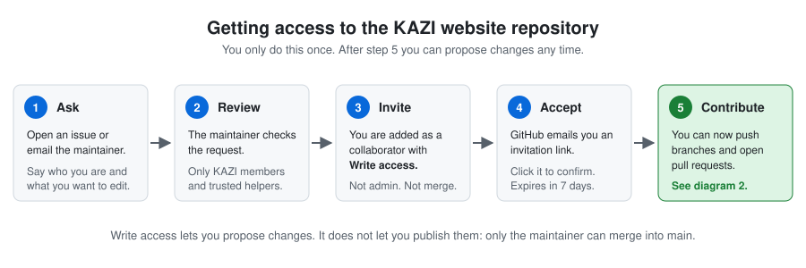

# KAZI website

Source code and content of the KAZI Switzerland website.

The site is a static site: plain HTML, CSS and JavaScript in `public/`, with all editable
content stored as JSON in `public/data/`. Anything merged into the `main` branch is
published automatically to the server by GitHub Actions.

## Want to help edit the site?

**Read [CONTRIBUTING.md](CONTRIBUTING.md) first.** It explains, without assuming any
GitHub experience:

- how to ask for access to this repository,
- how to propose a change through a pull request,
- who reviews it and how it gets published,
- why nothing goes online without a human reading it first.



## Ground rules

- `main` is the live website. It is protected: no direct pushes, no force pushes, no deletion.
- Every change arrives through a pull request, passes the automated checks, and is reviewed
  by a human before being merged.
- Only the maintainer ([@zeke321](https://github.com/zeke321)) merges into `main`.
- Never copy files onto the server by hand; the next deploy would overwrite them.

## Repository layout

| Path | Contents |
| --- | --- |
| `public/` | The website. Everything here is published. |
| `public/data/` | Content: projects, team, partners, reports, stats, texts. |
| `public/assets/` | Photos and logos. |
| `public/reports/` | PDF reports. |
| `scripts/check_data.py` | Validates the data files. Run before pushing. |
| `deploy/` | Server configuration (Caddy, VPS setup). |
| `.github/workflows/` | Automated checks and deployment. |
| `.pages.yml` | Pages CMS configuration: web forms for non-technical editors. |

## Working locally

```bash
git clone https://github.com/zeke321/kazi-website.git
cd kazi-website
python scripts/check_data.py
python -m http.server 8000 --directory public
```

Then open <http://localhost:8000>.

## Contact

Questions, access requests and bug reports: open an
[issue](https://github.com/zeke321/kazi-website/issues).
